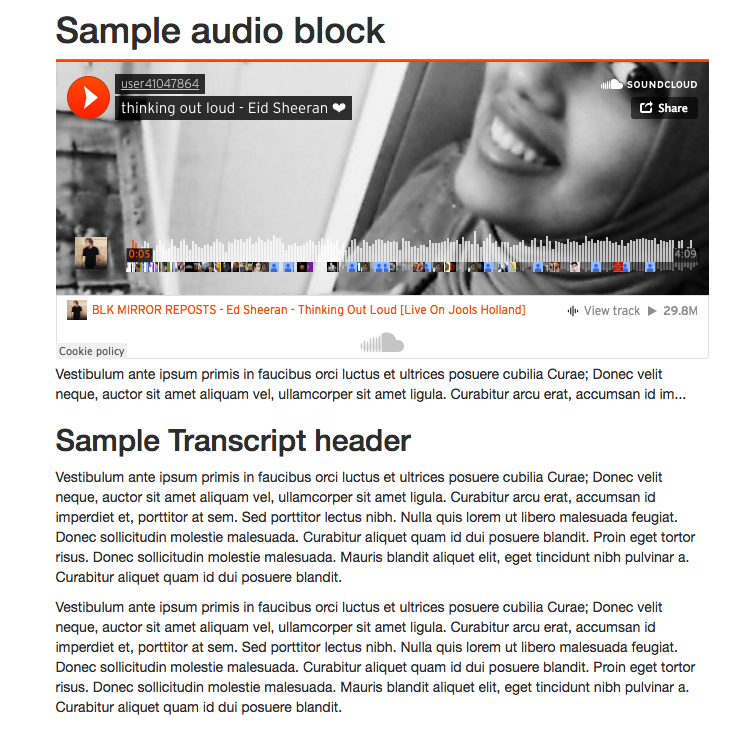
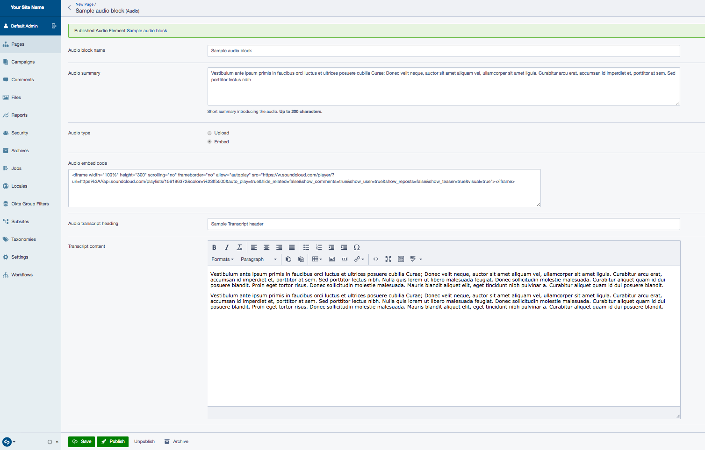
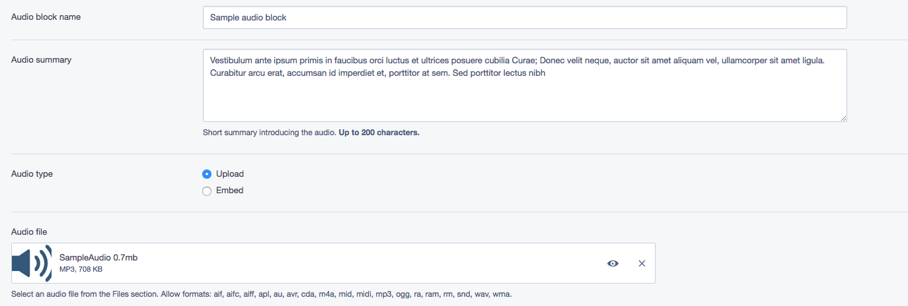
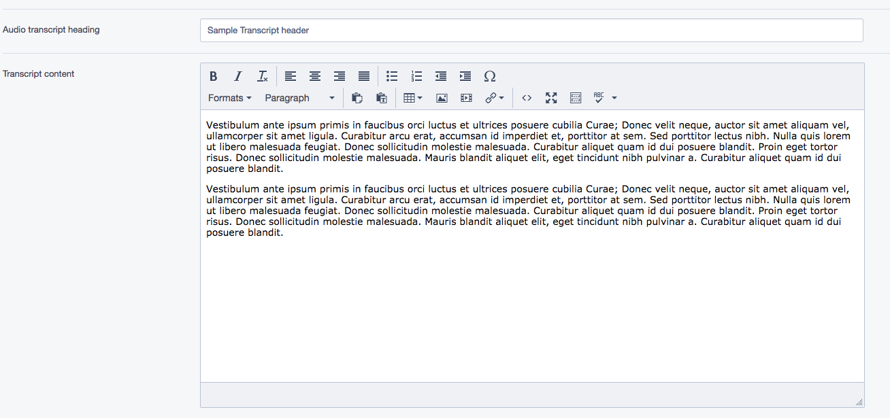

# SilverStripe Elemental Audio

Audo block for SilverStripe Elemental.

## Requirements

* SilverStripe ^4.0
* SilverStripe Elemental ^2.0
* Display Logic ^2.0

## Installation

`composer require ishannz/silverstripe-elemental-audio`

## Example usage

A block to display a audio player and transcript on your page.

## Screen Shots

#### Front End sample of a Audio Element (upload audio)

#### Front End sample of a Audio Element (embed audio)

#### CMS - Audio Element Main Tab

#### CMS - Audio Element upload audio

#### CMS - Audio Element embed audio

#### CMS - Audio Element - Transcript

## Configuration

See [SilverStripe Elemental Configuration](https://github.com/dnadesign/silverstripe-elemental#configuration)

